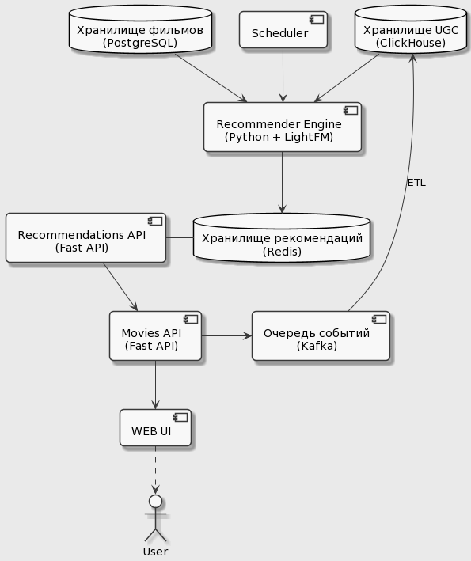

# Рекомендательная система

## Задача от бизнеса
Нужно, чтобы клиенты продлевали подписку каждый месяц и смотрели как можно больше фильмов.

## Гипотеза
Предполагаем, что чем больше мы покажем фильмов клиенту, которые ему понравятся, тем дольше он будет оставаться в нашем кинотеатре

Измерять качество нашей системы будем оценками пользователей, на наши рекомендации.

## ТЗ

Какие рекомендации будем показывать:

- Стоит посмотреть.
  Рекомендации будут формироваться по истории оценок фильмов
- Фильмы которые стоит посмотреть в разрезе жанров
- Для новых клиентов нужно показать топ фильмов по оценке imdb

## Архитектура



## Что к этому моменту уже было
- Movie API(FastAPI) берет данные по фильмам из эластика.
Также умеет класть UGC в брокер сообщений Kafka

- Pipeline для переноса UGC данных из Kafka в clickhouse.

## Что реализовали

### Recommender engine.
Код в директории recommender_engine

Описание:
- Используем алгоритмы машинного обучения.
Для этого используем библиотеку LightFM.
- Иcпользуем датасет от rotten tomatoes
- Сервис периодически обучается по оценкам пользователей и формирует для них рекомендации.
- Кладем рекомендации для пользователей в redis.
Формат: user_id: {"must_watch": [movie_id_1, movie_id_2,...]}

### Recommendations API
Код в директории recommendations_api

Описание:
- Ходит в redis за рекомендациями для пользователей.
- Берет данные по user_id
- Отдает id фильмов в Movies API


# Инфраструктура

## Запуск баз
Выполнить интрукцию из ```infrastructure/README.md```

## Запуск сервисов
```
docker-compose -f docker-compose-prod.yaml up --build -d
```
